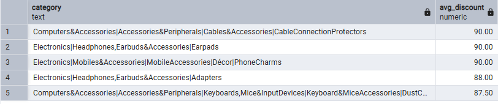
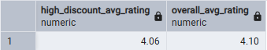
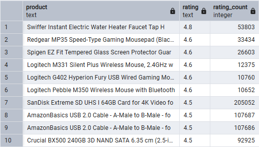
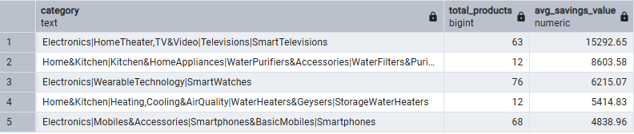
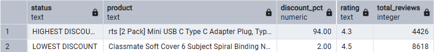

# 🛒 Amazon Sales & Pricing Strategy (SQL)

## 🎯 Project Overview

This project performs an Exploratory Data Analysis (EDA) on an Amazon dataset to uncover pricing strategies, consumer behavior, and product performance. I used PostgreSQL to clean, structure, and query the data to answer 5 key business questions.

## 📊 Database & Source

* **Source**:[Amazon Product Reviews Dataset on Kaggle] (https://www.kaggle.com/datasets/karkavelrajaj/amazon-sales-dataset)

* **Scope**: 1,000+ products analyzed across multiple categories.

* **Note**(: The full dataset is located in the /data folder, but due to file size limits, GitHub may not preview it online.

## 🛠️ Data Challenges & Cleaning (The ELT Process)
During the import process, I identified and resolved critical issues to enable numerical analysis:

* **Currency & Symbol Handling:** Cleaned the Indian Rupee (₹) symbols and special characters to convert prices into `NUMERIC`.
* **Fixing Commas:** Many numbers used commas as thousands separators (like 1,099). I removed them to change the format to 1099.00, which is the standard for SQL databases.
* **Percentage Transformation:** Stripped `%` characters and converted them into decimal values (e.g., 94% to 0.94) to allow calculations.
* **Data Integrity:** Handled inconsistent records (like the '|' character found in rating columns) to maintain a clean dataset for final insights.
* **Check the full code here:** [01_data_cleaning.sql](sql/01_data_cleaning.sql)

## 💡 Business Insights
I used SQL to answer specific business questions about Amazon's pricing and consumer behavior. Here are the findings:

### Q1: Top Categories by Discount
**Question:** Which categories are the most aggressive in their pricing strategy? 
* **Finding:** Categories like "Cables & Accessories" and "Earpads" reach average discounts of **90%**.
* **Insight:** This is a highly saturated market. Aggressive pricing is not just a choice, but a necessity to gain visibility in the "Accessories" search results.

### Q2: Quality vs. Price Perception
**Question:** Do massive discounts lead to poor customer ratings?
* **Finding:** High-discount products (>50%) maintain a **4.06 rating**, virtually identical to the store average of **4.10**.
* **Insight:** Customers don't perceive "cheap" as "low quality" here. This proves that flash sales can move inventory without damaging the brand's reputation for quality.

## Q3: Top Tier Products
**Question:** Which products have the best reputation and highest volume?
* **Finding:** Electronic items like the "Swiffer Water Heater" and "Logitech Mice" lead with ratings of **4.6 - 4.8** and thousands of reviews.
* **Insight:** These products represent the "safe bets" for consumers, combining high performance with massive social proof.

## Q4: Financial Impact (Real Cash Savings)
**Question:** Where does the customer save the most "real money" ?
* **Finding:** While accessories have higher percentages, **Smart TVs** offer the highest average cash savings (over **15,000** in local currency).
* **Insight:** High-ticket items drive the most significant financial impact for the consumer, even with smaller percentage discounts.

### Q5: Loss Leaders vs. Essential Goods
**Question:** How does Amazon use different products to drive traffic?
* **Finding:** A USB-C adapter at **94% off** (Loss Leader) vs. a student notebook at only **2% off** (Essential).
* **Insight:** This shows a clear strategy: use cheap gadgets as "hooks" to get people onto the site, knowing they will also buy essential items at full margin.

## 🏁 Conclusion
Through this SQL analysis, I identified a clear **"Hook & Margin" strategy**: Amazon uses extreme discounts on technical accessories as traffic drivers (Loss Leaders) while maintaining steady margins on essential goods that customers buy regardless of price. 
This project highlights my ability to translate complex database queries into actionable business intelligence, focusing on the real financial impact (nominal savings) rather than just looking at surface-level percentages. It demonstrates a full understanding of the data lifecycle, from deep cleaning to strategic insight.

## ✉️ Contact

* **Linkedin:** [Murilo Maffei Vitti](https://www.linkedin.com/in/murilomvitti/)
* **Email:** [murilo.mvitti@gmail.com](murilo.mvitti@gmail.com)
* **GitHub:** [MuriloVitti](https://github.com/MuriloVitti) 

